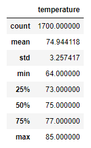
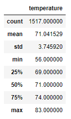
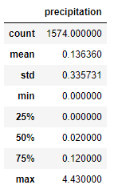
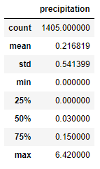

# surfs_up
## Project Overview
The purpose of this project is to connect to and query a SQLite database using the Python SQLAlchemy library to get temperature information and conduct statistical analysis on it. The customer wants temperature information for the months of June and December to determine if opening a surf and ice cream shop in Oahu, Hawaii is sustainable year-round.

## Project Results
The following are the three key differences between the weather in Oahu in June and December:
- The average temperature in June is about 3.9 degrees colder in December
- The minimum temperature in December is 8 degrees colder in December
- The maximum temperature in December is 2 degrees colder in December

### June Temperature Statistics

### December Temperature Statistics

## Project Summary
The weather in Oahu can probably sustain a year-round surf and ice cream shop since the temperature difference between June and December is approximately 4 degree difference in average. While the December low is 8 degrees, this may have an impact in the early morning timeframe until it warms up later in the day. Another factor to consider is that while it does get slightly colder in December, it also rains slightly more as well. In June the average precipitation is .1363 and in December it is .2168.

### June Precipitation Statistics

### December Precipitation Statistics

